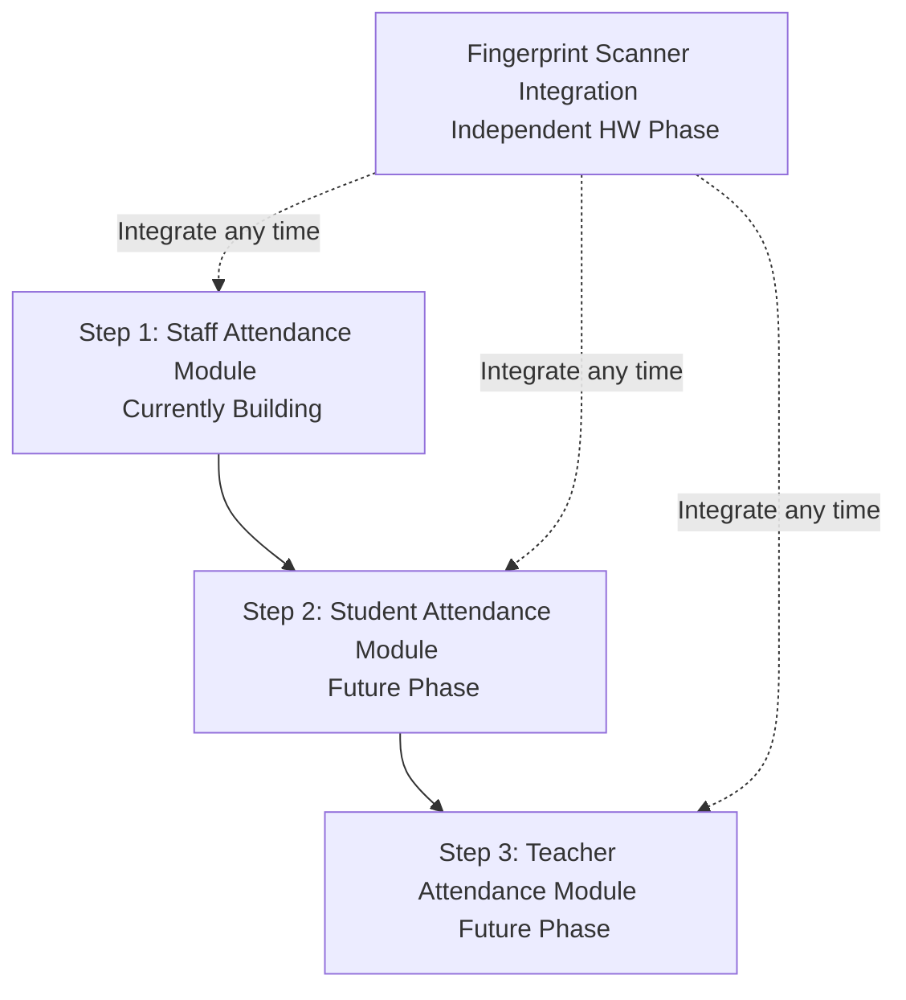

# Brain Stormers Attendance

This document serves as the single source of truth for any developer or AI agent working on **Brain Stormers Attendance**. It outlines the project's purpose, architecture, technical specifications, database schema, security rules, and future roadmap. All changes to this project must align with the decisions documented here.

---

## 1. Project Overview

*   **Project Name:** Brain Stormers Attendance
*   **Description:** A progressive web application (PWA) designed for coaching centers to track attendance digitally, replacing manual physical registers.
*   **Target Users:** 
    *   **Current Phase:** Staff members (12 users)
    *   **Planned Expansion:** Students and teachers
*   **Core Purpose:** To provide a modern, offline-capable, and secure system to record and audit daily attendance logs.

---

## 2. Tech Stack

*   **Frontend:** React (Vite-powered, module-ready React 18+ application)
*   **Database:** Firebase Firestore (NoSQL Document database)
*   **Authentication:** Firebase Authentication
*   **Hosting:** Firebase Hosting
*   **Application Type:** Progressive Web App (PWA) with fully enabled offline support, including Firestore offline persistence for reliability during network drops.
*   **UI/UX Paradigm:** **Neumorphism Premium** (Soft UI).
    *   Features a premium, tactile interface with dual shadows, extruded/pressed elements, and a clean minimalist color palette.
    *   Supports two complete, user-switchable styles: **Premium Light** (default on first load) and **Premium Dark**.

---

## 3. User Roles (Current & Planned)

The system supports granular roles to manage access:

| Role | Status | Description & Capabilities |
| :--- | :--- | :--- |
| **Admin** | Active | Full control. Can create staff accounts, view and manage all attendance logs, access the admin panel via a secret keyboard shortcut, and change their own password via the menu bar. |
| **Staff** | Active (Phase 1) | Log in via admin-created credentials, mark their own attendance, view team-wide status summaries on the dashboard overview, review attendance histories, and change their own password via the menu bar. |
| **Student** | Planned (Phase 2) | Students will log in to view their schedules, track personal attendance metrics, and receive attendance notifications. |
| **Teacher** | Planned (Phase 3) | Teachers will log in to mark student attendance, view class schedules, and review teaching hours. |

> [!NOTE]
> **Dashboard Team Visibility Update:**
> To accommodate operational coordination when an Admin is offline, the Staff dashboard/Overview page operates as a shared team-wide view rather than a strictly isolated personal profile. When staff log in, they see counts of active staff who are Present, Late, or Absent today, alongside their own personal status card ("My Status Today"). Firestore security rules allow read access to the overall attendance collection for all authenticated users to support this shared status visibility.

---

## 4. Authentication & Security Rules

*   **No Self-Signup:** Self-signup is disabled. Staff accounts can only be created by an Admin using Firebase Admin SDK (or Firebase Auth Admin cloud functions).
*   **Hidden Admin Access:** The Admin panel is not linked anywhere in the visible user interface. It is accessed exclusively via the secret keyboard shortcut:
    *   `Ctrl + Shift + Alt + A`
    *   Pressing this shortcut reveals a hidden login route/modal to access administrative capabilities.
*   **Password Updates:** Both Admins and Staff members can change their passwords directly from a dedicated section in the application menu bar/navbar once authenticated.
*   **Password Storage:** Plain-text passwords must never be stored in Firestore, logged, or exposed in any client-side code.

---

## 5. Database Structure (Firestore)

The database schema is structured to accommodate seamless expansion to students and teachers in later phases.

### A. Collections

#### `users` (Collection)
Keeps track of registered accounts.

*   `name` (string): Full name of the user.
*   `role` (string): User role (`"admin"` | `"staff"` | `"student"` | `"teacher"`).
*   `username` (string): Unique identifier for login.
*   `phone` (string): Contact number.
*   `joinDate` (timestamp): Date the account was registered.
*   `active` (boolean): Active status flag.

#### `attendance` (Collection)
Tracks daily attendance check-ins and check-outs.

*   `userId` (reference): Reference to the document in the `users` collection.
*   `role` (string): User's role at the time of entry. Used to filter logs (e.g., getting all staff logs vs. student logs) efficiently.
*   `date` (string): Date in `YYYY-MM-DD` format (allows easy queries by date string).
*   `checkIn` (timestamp): Time the user checked in.
*   `checkOut` (timestamp): Time the user checked out.
*   `status` (string): Attendance status (`"present"` | `"absent"` | `"late"`).
*   `markedBy` (string): Source of the attendance log (`"fingerprint"` | `"self-checkin"` | `"admin-manual"`).
*   `lastEditedBy` (string, optional): The UID of the Admin who manually updated this record (only present if adjusted).
*   `lastEditedAt` (timestamp, optional): The timestamp when this record was adjusted by an Admin (only present if adjusted).
*   `isDeleted` (boolean): Soft delete flag (default `false`). If `true`, the record is hidden from all active queries.

> [!NOTE]
> **Why is "role" duplicated in the `attendance` collection?**
> Storing the `role` directly inside the `attendance` document allows the system to support future student and teacher modules without restructuring the database. Queries can instantly filter attendance lists by role (e.g., retrieving only "staff" logs) without performing expensive cross-document lookups.

#### `auditLogs` (Collection)
Tracks all manual creations, adjustments, or soft-deletions of attendance records for governance.

*   `action` (string): The category of adjustment (`"create"` | `"update"` | `"delete"`).
*   `targetCollection` (string): The collection targeted by the change (always `"attendance"`).
*   `targetDocId` (string): The document ID of the affected attendance record.
*   `performedBy` (string): The UID of the Admin who executed the action.
*   `performedByName` (string): Denormalized display name of the Admin who performed the action.
*   `timestamp` (timestamp): Server-side timestamp indicating when the action occurred.
*   `reason` (string): Mandatory note/reason justifying the administrative adjustment.
*   `previousData` (map/object or null): Snapshot of the attendance document *before* the change (null for `"create"`).
*   `newData` (map/object or null): Snapshot of the attendance document *after* the change (null for `"delete"`).

#### `devices` (Collection)
Stores fingerprint device registrations and their SDK license keys.

*   `deviceName` (string): A human-readable label Admin assigns (e.g., `"Reception PC Scanner"`).
*   `licenseKey` (string): The ZKFinger SDK License/Activation Key.
    > [!WARNING]
    > **Sensitive Data Warning:**
    > The `licenseKey` is highly sensitive credential data. Treat this collection with the same care as any credential storage: never log the raw key value to the console in production code, and never expose it in any publicly shared screenshot or error message.
*   `active` (boolean): Default `true`. Allows Admin to deactivate a device's key without deleting the record entirely (e.g., if a PC is decommissioned).
*   `registeredBy` (string): Admin's UID who added this device.
*   `registeredByName` (string): Admin's display name.
*   `createdAt` (timestamp): Server-side timestamp indicating when the device was registered.
*   `lastFetchedAt` (timestamp or null): Updated whenever a desktop app successfully fetches this key (useful to show "last seen" information).

---

### B. Database Security Rules (CRITICAL)

Access control is enforced at the database layer using Firestore Security Rules, which reside in the project's root [firestore.rules](file:///c:/Users/niaz/Desktop/Brain-Stormers/Projects/Brain-Stormers-Attendance/firestore.rules) file.

Key security controls enforced:
1.  **No Open Access:** No collection is left in test mode or open to the public. All operations require user authentication (`request.auth != null`).
2.  **User Profiles Security (`/users/{userId}`):**
    *   **Read:** Any authenticated user can read their own profile document. Only users with the `"admin"` role can read profiles belonging to other users.
    *   **Write (Create, Update, Delete):** Restricted exclusively to users with the `"admin"` role.
3.  **Attendance Record Isolation (`/attendance/{attendanceId}`):**
    *   **Create:** Requester must be signed in, and the `userId` in the created record must match their authenticated UID (preventing staff from creating logs for others).
    *   **Read:** Staff users can only read logs matching their own `userId`. Admins can read all logs.
    *   **Update:** Staff can only update their own records and are strictly restricted to modifying the `checkOut` and `status` fields (using the rules `diff().affectedKeys()` validation). Admins can update any field.
    *   **Delete:** Restricted exclusively to users with the `"admin"` role.
4.  **Role Verification Helper:** Rules utilize a reusable `isAdmin()` lookup that reads `/users/$(request.auth.uid)` to verify roles securely.
5.  **Device Registry Security (`/devices/{deviceId}`):**
    *   **Read/Write (Create, Update, Delete):** Restricted exclusively to users with the `"admin"` role. Staff members are blocked from reading or writing to this collection entirely.
    *   *Note on Desktop App:* The standalone desktop application (using Node.js/Electron with the Firebase Admin SDK) executes in a privileged environment with trusted server credentials, bypassing these rules to fetch keys securely.
6.  **UX vs. Security Boundary:** 
    > [!IMPORTANT]
    > Client-side checks (e.g., hiding buttons or blocking paths in React Router) are for **UX only**. Real data protection happens in `firestore.rules`. Never rely on frontend logic to secure the database.

### C. Audit & Soft-Delete Policy

To ensure complete operational integrity, transparency, and accountability:
1.  **Soft-Deletes Only:** No client-side SDK is permitted to hard-delete attendance documents from Firestore. In the database rules, `allow delete` is blocked entirely. Adjustments that delete a record must set `isDeleted: true`. Queries listing records must exclude those with `isDeleted == true`.
2.  **Immutability of Audit Logs:** The `/auditLogs` collection is immutable. Rules prohibit updates or deletions (`allow update, delete: if false;`) by anyone. This prevents the cover-up of modifications, preserving a reliable audit trail.
3.  **Mandatory Reason Entry:** Every manual override (creating, editing, or deleting) requires the Admin to provide a textual reason, stored under the `reason` field in `auditLogs`.
4.  **Governance Dashboard View:** Admins are equipped with a dedicated "Audit Log" route that details every manual creation, update, and soft-deletion. It features action badges, date/staff/action filters, and side-by-side difference comparison panels highlighting field changes. Regular staff accounts are blocked from accessing this view via both client navigation and route protection middleware.

---

## 6. Folder Structure Explanation

To support scale, clean code boundaries, and parallel feature development, the codebase uses a **module-based / feature-based** structure.

All features are self-contained inside `src/modules/`.
*   Example: [src/modules/staff-attendance](file:///c:/Users/niaz/Desktop/Brain-Stormers/Projects/Brain-Stormers-Attendance/src/modules/staff-attendance) houses the views, components, and service utilities exclusive to staff attendance.
*   This pattern ensures that future modules (e.g., `student-attendance`, `teacher-attendance`) can be plugged in without refactoring existing codebase sections.

For directory paths, layout conventions, and coding patterns, consult the mandatory guidelines in [FOLDER_RULES.md](file:///c:/Users/niaz/Desktop/Brain-Stormers/Projects/Brain-Stormers-Attendance/FOLDER_RULES.md).

---

## 7. Future Roadmap

Development must progress in the following strict order. Do not skip steps or work on later modules out of order.

1.  **Step 1 (CURRENT): Staff Module** — Phase 1-7. Implement desktop/mobile views, checking in/out, history, and basic admin utilities.
2.  **Step 2 (NEXT): Student Module** — Built only after the Staff module is fully complete, tested, and marked stable.
3.  **Step 3 (LAST): Teacher Module** — Built only after the Student module is stable.
4.  **Hardware Phase: Fingerprint Scanner Integration (Independent)**
    *   A physical biometric scanner (e.g., ZKTeco-style hardware) will be linked via a middleware bridge script that pushes check-in times to Firestore.
    *   For now, attendance is marked manually in the UI, but the schema includes `markedBy` (`"fingerprint"` | `"self-checkin"` | `"admin-manual"`) so the hardware or self-checkin interfaces can be integrated at any point without schema modifications.

---

## 7.5 Staff Attendance Module (Specs)

The "Staff Attendance" module is a shared route accessible at `/staff-attendance` containing role-based dashboards, interactive month calendars, and data exporting.

### A. Role-Based Capabilities
1. **Admin Dashboard**:
   - **Metrics Overview**: Displays Present Today, Absent Today, Late Today, and Period Average Attendance %.
   - **Filter Controls**: Features Date Range pickers (`From` and `To`), type-ahead searchable staff names auto-completion dropdown, and multi-select status chips.
   - **Attendance Logs Table**: Renders UIDs as friendly staff names using an in-memory profile directory lookup. Includes pagination (8 rows per page).
   - **Calendar Month Grid**: Renders active/padding day grids showing color status dots representing logs breakdown. Clicking a day opens a popover detailing all active staff check-in/out statuses for that day.
   - **Monthly Summary Table**: Separate roster table detailing Present, Absent, and Late days, plus final attendance percentage. Supports clickable sorting (ascending/descending) on any column.
2. **Staff Dashboard**:
   - **Metrics Overview**: Displays personal Check-In Status today, present days count, absent days count, and overall attendance rate.
   - **Filter Controls**: Restricts filters to Date range selection and status toggles (completely omits the staff member search input).
   - **Attendance Logs Table**: Renders user-isolated history logs (omits the "Staff Name" column).
   - **Calendar Month Grid**: Renders a personal calendar showing a single color status dot. Clicking a day opens a modal card showing check-in and check-out timestamps.

### B. Shared Neumorphic Components
- **[NeuBadge](file:///c:/Users/niaz/Desktop/Brain-Stormers/Projects/Brain-Stormers-Attendance/src/shared/components/NeuBadge.jsx)**: A tactile badge displaying attendance status with colored border glows (`present` green, `late` amber, `absent` red).
- **[NeuSegmentedControl](file:///c:/Users/niaz/Desktop/Brain-Stormers/Projects/Brain-Stormers-Attendance/src/shared/components/NeuSegmentedControl.jsx)**: A pill-shaped segmented tabs controller. Utilizes dynamic DOM offset coordinates measurements (`offsetLeft` and `offsetWidth`) to animate a raised Neumorphic background slider thumb behind static label text.

### C. Data Export Engines
- **CSV Export**: plain comma-separated values blob downloaded client-side. Respects active filters. Admin files include full details, while staff files exclude the "Staff Name" column.
- **PDF Export**: print-optimized layout written to a target window (`window.open`). Summarizes active search filters in a slate box, and renders a clean, professional border-based table with a generation timestamp footer.
- **Export Control**: Dropdown menu opens with a slide-down + fade-in CSS keyframes animation. Escape key pressing and clicking outside auto-dismisses the dropdown.

### D. Time-Limited Staff Self-Edit System (Self-Correction Window)
To allow staff members to quickly correct honest entry mistakes (e.g., choosing the wrong status or selecting the wrong check-in time), a lightweight self-edit window is implemented:
1. **The Edit Window**: Valid for exactly 10 minutes from the record's creation time (`createdAt`). This configuration is defined via the `EDIT_WINDOW_MINUTES = 10` constant in the staff dashboard module.
2. **Eligibility Checks**: A record is editable by a staff member only if:
   - The record was created within the last 10 minutes (based on `createdAt`).
   - The record was created by the currently logged-in user (`markedByUserId == currentUser.uid`). This means a user can edit records they logged for themselves or logs they peer-marked for colleagues within the 10-minute window.
3. **UI Elements**: 
   - Eligible cards/rows in the table and calendar details modal display a small "Edit" icon alongside a live countdown timer showing the remaining minutes and seconds (e.g., `"Editable for 4:32"`). 
   - The countdown timer updates in real-time every second and disappears instantly once the window reaches zero (no page reload required).
4. **Lightweight Modal**: 
   - Clicking Edit opens a simplified modal with only the `Check-In Time` and `Status` (Present/Late) fields editable.
   - Date and assignee (`userId`) are non-modifiable. No reason is required to submit.
5. **Database Updates & Governance**:
   - On submission, the attendance document is updated with the new fields, plus `selfEdited: true` and `selfEditedAt: serverTimestamp()`.
   - A corresponding audit log is written to `/auditLogs` with `action: "self-edit"` and `performedBy: currentUser.uid` for governance and misuse monitoring.
6. **Security Rules Enforcement**:
   - `firestore.rules` enforces that non-admin updates are blocked unless `resource.data.markedByUserId == request.auth.uid` AND `request.time < resource.data.createdAt + duration.value(10, 'm')` (matching the 10-minute server-side verification). Non-admin updates are strictly limited to the `checkIn`, `status`, `selfEdited`, and `selfEditedAt` fields.
   - Non-admin creation of `auditLogs` is allowed for `action` in `['create', 'self-edit']` and where `performedBy == request.auth.uid` (supporting audit logging of staff peer-marking and self-correction creations).

### E. Misuse Monitoring Dashboard (Governance & Compliance)
To prevent collusive check-in behaviors or self-correction window gaming since Staff can self-create and self-edit entries without Admin pre-approval:
1. **Access Gating**: Restricted exclusively to users with the `"admin"` role, protected by frontend route-guards and backend Firestore rules. Linked in the sidebar nav near "Audit Log".
2. **Analysis Calculations (Client-Side)**:
   - **Frequent Peer-Markers**: Groups audit logs with `action: "create"` where `performedBy != newData.userId`. Ranks creators highest-to-lowest based on how many logs they logged for colleagues.
   - **Self-Edits Frequency**: Groups audit logs with `action: "self-edit"` and ranks users by their self-correction frequency in the selected date range.
   - **Same-Person Repeated Peer-Marking**: Groups peer-marked creations by the specific pair `(performedBy, newData.userId)`. Flags collusions where Staff A repeatedly marks Staff B (visually highlighting cases exceeding 3 repeats).
   - **Edits Right Before Window Expiry**: Scans `self-edit` logs and flags adjustments completed in the final 60 seconds (remaining seconds < 60s) of the 10-minute correction window.
3. **Interactive Drilldown**: Each flagged list item or row is expandable. Clicking it lists all related audit logs. Each log in the list can be further expanded to show the side-by-side values difference comparison comparison table.
4. **Date Filtering**: Includes a top-level Date Range filter (defaulting to the last 30 days) that instantly recalculates all metrics and lists client-side.

---

## 7.6 Device Management Module (Specs)

The "Device Management" module is an administrative dashboard accessible at `/device-management` for registering fingerprint scanning devices and caching their active SDK license keys centrally.

### A. Role-Based Gating
- **Admin-Only Page:** Protected at the React routing level via `<ProtectedRoute requiredRole="admin">` and at the navigation level in `DashboardLayout.jsx`. 
- **Visibility:** The entire "Device Management" section in the sidebar remains completely hidden and unreachable for standard Staff members.

### B. Core Features & User Workflows
1. **Device Registry Form:**
   - Housed inside a raised Neumorphic card (`NeuCard`).
   - Fields: **Scanner Name** (friendly name assigned by Admin, e.g., `"Reception PC Scanner"`), **SDK License Key** (sensitive text), and **Portal Access Toggles** (enable/disable for Staff and Teacher portals using Neumorphic sliding toggles).
   - **Masking Eye Toggle:** The license input field defaults to a masked password-style type. A Neumorphic reveal toggle button allows Admins to inspect the entered key safely before submitting.
2. **Devices Inventory Table:**
   - Displays all registered device records sorted chronologically.
   - **Key Protection (Masking):** By default, keys are partially masked (e.g. `ZKF1••••••••89AB`) to prevent visual key snooping.
   - **Timed Reveal Handler:** Clicking the reveal icon unmasks the key, with an automatic 5-second re-masking timeout.
   - **Portal Toggles:** Renders two sliding toggle switches (**Staff Portal** and **Teacher Portal**). Toggling a switch directly updates the database to activate/deactivate the scanner's sync privilege for that group.
3. **Registry Actions:**
   - **Edit Registration:** Opens a pre-filled popup modal inside the Neumorphic environment, allowing modifications to the name, key, and portal toggles.
   - **Delete Registration:** Removes the device profile completely from Firestore, guarded by a standard validation confirmation prompt.

---

## 8. Design System & UX Notes

*   **Visual Style:** Neumorphism Premium. Soft dual shadows (`box-shadow: 8px 8px 16px var(--shadow-dark), -8px -8px 16px var(--shadow-light)`).
*   **Dual Themes:**
    *   **Light Theme** (Default): Soft gray-blue base (`#e2e8f0` / HSL equivalent) with subtle shadows.
    *   **Dark Theme**: Rich slate/navy base (`#0f172a` / HSL equivalent) with deep shadows and neon accents.
*   **Centralized Styling:** Theme variables, custom shadows, and font rules are maintained in a global styles directory ([src/styles](file:///c:/Users/niaz/Desktop/Brain-Stormers/Projects/Brain-Stormers-Attendance/src/styles)). Do not hardcode specific hex codes or shadow sets locally in React components.
*   **Theme Switcher:** A user-accessible theme toggle is embedded in the main navigation bar. Theme preferences persist across sessions.

---

## 8B. Language Rule (STRICT)

> [!WARNING]
> **English-Only UI Requirement**
> *   All user interface copy (buttons, menus, placeholders, dashboard logs, table headers, error codes, and instructions) must be written in **English only**.
> *   Bangla (Bengali) script or Banglish must **never** be used in any user-facing screen.
> *   This rule is absolute and applies to all current and future modules.
> *   Code comments and commit logs must also be written in English.

---

## 9. Admin Panel Access Rule

Access is activated solely by the keyboard shortcut:
*   `Ctrl + Shift + Alt + A`

There must never be a button, link, hidden tap target, or text hint in the UI pointing to the admin login. Developers and AI agents must preserve this keyboard event listener and never expose this route to regular navigation menus.

---

## 10. Development Rules for Future Agents/Developers

1.  **Read First:** Always read this `PROJECT.md` and [FOLDER_RULES.md](file:///c:/Users/niaz/Desktop/Brain-Stormers/Projects/Brain-Stormers-Attendance/FOLDER_RULES.md) before building or editing code.
2.  **Follow the Pattern:** Maintain strict modularity inside `src/modules/`.
3.  **Role Integrity:** Do not change the Firestore schema to bypass role filtering.
4.  Document Changes: Keep `PROJECT.md` updated as new features or integrations are successfully deployed.
5.  Environment Variables: Do not hardcode Firebase configurations, API keys, or operational configurations. Always load them from environment variables via `.env`.

---

## 11. Automated Release Pipeline (CI/CD)

The desktop application wrapper supports fully automated Windows installer compilation and publishing using **GitHub Actions**.

### A. Workflow Configuration
The release pipeline is defined in [release.yml](file:///.github/workflows/release.yml) and runs on a `windows-latest` virtual runner. It executes the following steps:
1.  Checks out the latest repository code.
2.  Sets up Node.js (version 20).
3.  Installs parent PWA project dependencies and compiles the Vite production bundle (`dist/`).
4.  Installs desktop wrapper dependencies inside the `Brain-Stormers-Desktop/` directory.
5.  Runs `electron-builder --publish always` to package the app and publish it directly to **GitHub Releases**.

### B. Versioning & Tagging Rule
*   **Manual Bump Requirement:** The CI pipeline relies on the `"version"` field inside the desktop wrapper's [`package.json`](file:///c:/Users/niaz/Desktop/Brain-Stormers/Projects/Brain-Stormers-Attendance/Brain-Stormers-Desktop/package.json#L3). **You must manually bump this version number** to match the target release (e.g., changing `0.1.0` to `0.1.1`) before triggering a release.
*   **Trigger:** Pushing a git tag matching the pattern `v*` (e.g., `v0.1.1`) triggers the GitHub Actions workflow. The build will succeed, compile the Windows executable with version `0.1.1`, and upload it as a published release.

---

## 12. GPU and Hardware Acceleration Compatibility Fix (v1.0.4)

To resolve issues where specific hardware/graphics driver configurations cause the app to crash with a white screen (throwing a `Renderer Process Gone` error due to GPU incompatibilities), the following measures have been implemented:

1. **Disabled Hardware Acceleration**: `app.disableHardwareAcceleration()` is invoked as the absolute first executable statement in [`main.js`](file:///c:/Users/niaz/Desktop/Brain-Stormers/Projects/Brain-Stormers-Attendance/Brain-Stormers-Desktop/main.js#L2) (before requiring libraries like `electron-updater` or executing any other Electron API calls).
2. **Automatic Crash Recovery**: The `render-process-gone` event handler has been upgraded to automatically restart/reload the collapsed window via `mainWindow.reload()`.
3. **Infinite Reload Protection**: Automatic reloads are gated to prevent loop-locking. The app tracks reload timestamps and will only auto-reload if there are fewer than 3 attempts in the last 60 seconds.
4. **User-Facing Alert**: If the renderer crashes repeatedly (3 or more times within 60 seconds), the app displays a native error dialog prompting the user: *"The app encountered a repeated rendering issue. Please restart the application."* instead of failing silently with a blank screen.

---

## 13. Native Biometric Scanner Disconnection / Presence Protection Fix (v1.0.5)

To prevent hard native crashes (throwing exception code `0x80000003` inside `libzkfp.dll` via Koffi bindings) on machines that do not have a physical fingerprint scanner connected:

1. **Pre-checks Connection Count**: The desktop application calls `ZKFPM_GetDeviceCount()` inside [`fingerprintSdk.js`](file:///c:/Users/niaz/Desktop/Brain-Stormers/Projects/Brain-Stormers-Attendance/Brain-Stormers-Desktop/src/main/fingerprintSdk.js#L93) before invoking any hardware initialization, device opening, or biometric capture functions.
2. **Device Connection Guarding**: If the device count is 0, the app bypasses all native capture calls (like `ZKFPM_OpenDevice` and `ZKFPM_AcquireFingerprint`) completely. This prevents unmanaged driver-level faults when no reader is available.
3. **Dynamic Standby and Autodetect**:
   - The background biometrics listening loop polls the device count every 10 seconds.
   - If a device is unplugged or plugged in, the app dynamically detects the hardware status change.
   - On connection, it initializes and resumes fingerprint listening automatically.
   - On disconnection, it halts scanner loops gracefully and goes into standby mode.
4. **Informational UI States**: A status-change listener is established between the main thread and the web application. When no device is present, the "🔍 Fingerprint Tester" widget displays *"No fingerprint scanner detected"* as a clean gray informational state, rather than showing a red error block or crashing the application.
5. **Koffi Error Protection**: All JavaScript wrapper calls mapping native functions are wrapped in explicit `try/catch` statements to catch manageable koffi or binding errors cleanly.

---

## 14. Single-Instance Application Locking (v1.0.6)

To prevent duplicate processes from launching (which causes conflicts because multiple processes attempt to access the physical fingerprint scanner device exclusively, causing the second process to hang infinitely on loading):

1. **Single Instance Lock**: The app utilizes `app.requestSingleInstanceLock()` as the first setup step. If a second instance is started while the first instance is active, the second instance exits immediately via `app.quit()`.
2. **Second Instance Restoration**: When a second launch is attempted, the first instance intercepts the `'second-instance'` event, logs the attempt, and automatically restores, shows, and focuses the existing hidden window.

