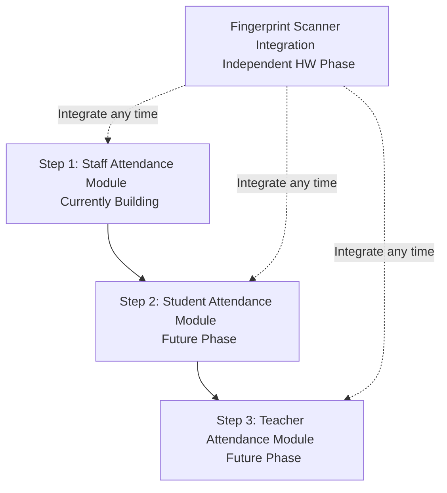

# Brain Stormers Attendance

This document serves as the single source of truth for any developer or AI agent working on **Brain Stormers Attendance**. It outlines the project's purpose, architecture, technical specifications, database schema, security rules, and future roadmap. All changes to this project must align with the decisions documented here.

---

## 1. Project Overview

*   **Project Name:** Brain Stormers Attendance
*   **Description:** A progressive web application (PWA) designed for coaching centers to track attendance digitally, replacing manual physical registers.
*   **Target Users:** 
    *   **Current Phase:** Staff members (12 users)
    *   **Planned Expansion:** Students and teachers
*   **Core Purpose:** To provide a modern, offline-capable, and secure system to record and audit daily attendance logs.

---

## 2. Tech Stack

*   **Frontend:** React (Vite-powered, module-ready React 18+ application)
*   **Database:** Firebase Firestore (NoSQL Document database)
*   **Authentication:** Firebase Authentication
*   **Hosting:** Firebase Hosting
*   **Application Type:** Progressive Web App (PWA) with fully enabled offline support, including Firestore offline persistence for reliability during network drops.
*   **UI/UX Paradigm:** **Neumorphism Premium** (Soft UI).
    *   Features a premium, tactile interface with dual shadows, extruded/pressed elements, and a clean minimalist color palette.
    *   Supports two complete, user-switchable styles: **Premium Light** (default on first load) and **Premium Dark**.

---

## 3. User Roles (Current & Planned)

The system supports granular roles to manage access:

| Role | Status | Description & Capabilities |
| :--- | :--- | :--- |
| **Admin** | Active | Full control. Can create staff accounts, view and manage all attendance logs, access the admin panel via a secret keyboard shortcut, and change their own password via the menu bar. |
| **Staff** | Active (Phase 1) | Log in via admin-created credentials, mark their own attendance, view their personal attendance history, and change their own password via the menu bar. |
| **Student** | Planned (Phase 2) | Students will log in to view their schedules, track personal attendance metrics, and receive attendance notifications. |
| **Teacher** | Planned (Phase 3) | Teachers will log in to mark student attendance, view class schedules, and review teaching hours. |

---

## 4. Authentication & Security Rules

*   **No Self-Signup:** Self-signup is disabled. Staff accounts can only be created by an Admin using Firebase Admin SDK (or Firebase Auth Admin cloud functions).
*   **Hidden Admin Access:** The Admin panel is not linked anywhere in the visible user interface. It is accessed exclusively via the secret keyboard shortcut:
    *   `Ctrl + Shift + Alt + A`
    *   Pressing this shortcut reveals a hidden login route/modal to access administrative capabilities.
*   **Password Updates:** Both Admins and Staff members can change their passwords directly from a dedicated section in the application menu bar/navbar once authenticated.
*   **Password Storage:** Plain-text passwords must never be stored in Firestore, logged, or exposed in any client-side code.

---

## 5. Database Structure (Firestore)

The database schema is structured to accommodate seamless expansion to students and teachers in later phases.

### A. Collections

#### `users` (Collection)
Keeps track of registered accounts.

*   `name` (string): Full name of the user.
*   `role` (string): User role (`"admin"` | `"staff"` | `"student"` | `"teacher"`).
*   `username` (string): Unique identifier for login.
*   `phone` (string): Contact number.
*   `joinDate` (timestamp): Date the account was registered.
*   `active` (boolean): Active status flag.

#### `attendance` (Collection)
Tracks daily attendance check-ins and check-outs.

*   `userId` (reference): Reference to the document in the `users` collection.
*   `role` (string): User's role at the time of entry. Used to filter logs (e.g., getting all staff logs vs. student logs) efficiently.
*   `date` (string): Date in `YYYY-MM-DD` format (allows easy queries by date string).
*   `checkIn` (timestamp): Time the user checked in.
*   `checkOut` (timestamp): Time the user checked out.
*   `status` (string): Attendance status (`"present"` | `"absent"` | `"late"`).
*   `markedBy` (string): Source of the attendance log (`"manual"` | `"fingerprint"`).

> [!NOTE]
> **Why is "role" duplicated in the `attendance` collection?**
> Storing the `role` directly inside the `attendance` document allows the system to support future student and teacher modules without restructuring the database. Queries can instantly filter attendance lists by role (e.g., retrieving only "staff" logs) without performing expensive cross-document lookups.

---

### B. Database Security Rules (CRITICAL)

Access control must be enforced at the database layer. Firestore Security Rules dictate the following security properties:

1.  **No Test Mode in Production:** Collections must never be left with open read/write rules (`allow read, write: if true;`).
2.  **Staff Data Isolation:** Staff members can only read and write their own attendance records. They must not have read or write access to other staff members' data.
3.  **Admin Auth Scope:** Only users with the `"admin"` role are authorized to create, update, or delete documents in the `users` collection.
4.  **Admin Attendance Scope:** Only users with the `"admin"` role can read attendance records belonging to other users.
5.  **Minimum Authentication:** All writes to any collection require the request to be authenticated at minimum (`request.auth != null`), followed by validation of matching roles or user IDs.
6.  **Rule Integration Workflow:** Real Firestore Security Rules must be reviewed and deployed from the project file (`firestore.rules`) every time a new collection or field is introduced.
7.  **UX vs. Security Boundary:** 
    > [!IMPORTANT]
    > Client-side checks (e.g., hiding buttons or blocking paths in React Router) are for **UX only**. Real data protection must happen in `firestore.rules`. Never rely on frontend logic to secure the database.

---

## 6. Folder Structure Explanation

To support scale, clean code boundaries, and parallel feature development, the codebase uses a **module-based / feature-based** structure.

All features are self-contained inside `src/modules/`.
*   Example: [src/modules/staff-attendance](file:///c:/Users/niaz/Desktop/Brain-Stormers/Projects/Brain-Stormers-Attendance/src/modules/staff-attendance) houses the views, components, and service utilities exclusive to staff attendance.
*   This pattern ensures that future modules (e.g., `student-attendance`, `teacher-attendance`) can be plugged in without refactoring existing codebase sections.

For directory paths, layout conventions, and coding patterns, consult the mandatory guidelines in [FOLDER_RULES.md](file:///c:/Users/niaz/Desktop/Brain-Stormers/Projects/Brain-Stormers-Attendance/FOLDER_RULES.md).

---

## 7. Future Roadmap

Development must progress in the following strict order. Do not skip steps or work on later modules out of order.

1.  **Step 1 (CURRENT): Staff Module** — Phase 1-7. Implement desktop/mobile views, checking in/out, history, and basic admin utilities.
2.  **Step 2 (NEXT): Student Module** — Built only after the Staff module is fully complete, tested, and marked stable.
3.  **Step 3 (LAST): Teacher Module** — Built only after the Student module is stable.
4.  **Hardware Phase: Fingerprint Scanner Integration (Independent)**
    *   A physical biometric scanner (e.g., ZKTeco-style hardware) will be linked via a middleware bridge script that pushes check-in times to Firestore.
    *   For now, attendance is marked manually in the UI, but the schema includes `markedBy` (`"manual"` | `"fingerprint"`) so the hardware can be integrated at any point without schema modifications once purchased.

---

## 8. Design System & UX Notes

*   **Visual Style:** Neumorphism Premium. Soft dual shadows (`box-shadow: 8px 8px 16px var(--shadow-dark), -8px -8px 16px var(--shadow-light)`).
*   **Dual Themes:**
    *   **Light Theme** (Default): Soft gray-blue base (`#e2e8f0` / HSL equivalent) with subtle shadows.
    *   **Dark Theme**: Rich slate/navy base (`#0f172a` / HSL equivalent) with deep shadows and neon accents.
*   **Centralized Styling:** Theme variables, custom shadows, and font rules are maintained in a global styles directory ([src/styles](file:///c:/Users/niaz/Desktop/Brain-Stormers/Projects/Brain-Stormers-Attendance/src/styles)). Do not hardcode specific hex codes or shadow sets locally in React components.
*   **Theme Switcher:** A user-accessible theme toggle is embedded in the main navigation bar. Theme preferences persist across sessions.

---

## 8B. Language Rule (STRICT)

> [!WARNING]
> **English-Only UI Requirement**
> *   All user interface copy (buttons, menus, placeholders, dashboard logs, table headers, error codes, and instructions) must be written in **English only**.
> *   Bangla (Bengali) script or Banglish must **never** be used in any user-facing screen.
> *   This rule is absolute and applies to all current and future modules.
> *   Code comments and commit logs must also be written in English.

---

## 9. Admin Panel Access Rule

Access is activated solely by the keyboard shortcut:
*   `Ctrl + Shift + Alt + A`

There must never be a button, link, hidden tap target, or text hint in the UI pointing to the admin login. Developers and AI agents must preserve this keyboard event listener and never expose this route to regular navigation menus.

---

## 10. Development Rules for Future Agents/Developers

1.  **Read First:** Always read this `PROJECT.md` and [FOLDER_RULES.md](file:///c:/Users/niaz/Desktop/Brain-Stormers/Projects/Brain-Stormers-Attendance/FOLDER_RULES.md) before building or editing code.
2.  **Follow the Pattern:** Maintain strict modularity inside `src/modules/`.
3.  **Role Integrity:** Do not change the Firestore schema to bypass role filtering.
4.  **Document Changes:** Keep `PROJECT.md` updated as new features or integrations are successfully deployed.
5.  **Environment Variables:** Do not hardcode Firebase configurations, API keys, or operational configurations. Always load them from environment variables via `.env`.
